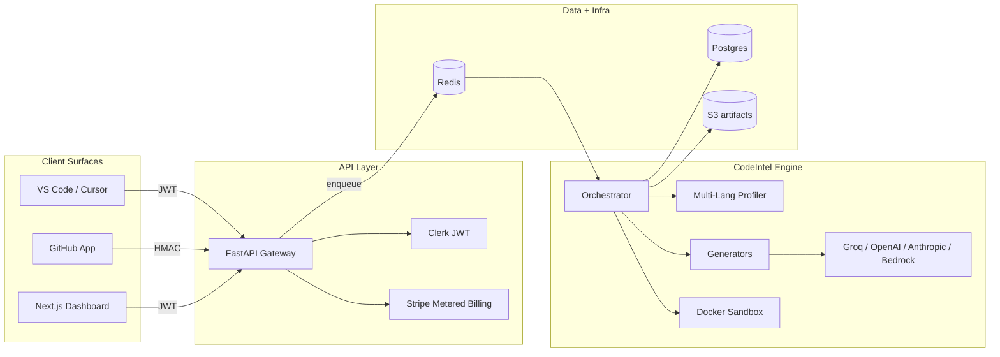

# CodeIntel

> AI test engineer that lives in your repo.

CodeIntel is a multi-surface platform that scans your code, generates
high-coverage `pytest` and `jest` suites, validates them in a sandboxed
container, and opens a clean PR. Three surfaces, one engine:

- **GitHub App** — auto-opens PRs with tests for newly-changed functions.
- **VS Code / Cursor extension** — right-click any function → tests in seconds.
- **SaaS dashboard** — coverage trends, run history, billing, team management.

[](.github/workflows/ci.yml)
[](https://www.python.org/)
[](LICENSE)

## Why CodeIntel

- **Sandboxed validation, not vibes.** Every generated test runs in an
  ephemeral Docker container with `--network=none`, a read-only repo mount,
  and tight CPU/memory caps. We never accept a test that fails to execute.
- **Self-healing.** When the sandbox rejects a test, we feed the exact
  failure back to the model and try again (up to N retries).
- **BYO-LLM.** Use our Groq tier or route through your own AWS Bedrock /
  Azure OpenAI. Your code stays in your cloud.
- **Polyglot.** Python + TypeScript / JavaScript out of the box, with an
  adapter pattern that drops Java / Go / C# in next.
- **Mutation-aware.** Optional [mutation testing](packages/engine/codeintel_engine/mutation.py)
  proves the generated tests actually catch bugs — not just pad coverage.
- **Flaky-test guard.** We re-run every generated test 5x before merging;
  flaky tests never reach your PR.

## Architecture



Full design in [`docs/architecture.md`](docs/architecture.md).

## Repository layout

```
apps/
  api/              FastAPI gateway, GitHub + Stripe webhooks, OAuth device flow
  dashboard/        Next.js 14 (App Router) + Tailwind + Clerk + Stripe
  vscode-extension/ VS Code / Cursor extension (TypeScript)
packages/
  engine/           Pure-Python engine (profilers, generators, sandbox, orchestrator)
    legacy/         Original revision_*.py prototypes (kept as reference)
  sdk-ts/           Typed TS SDK shared by the dashboard + extension
  ui/               Shared shadcn-style React primitives
infra/
  docker/           Sandbox images (codeintel-py, codeintel-node)
  helm/             Helm chart for self-hosted enterprise
  terraform/        AWS reference deployment (VPC + ECS + RDS + ElastiCache)
  docker-compose.yml  Local dev (api + dashboard + postgres + redis)
docs/
  architecture.md   System design
  security.md       Threat model, SOC 2 readiness
  self-hosting.md   Enterprise install
  pricing.md        Plans + metering
```

## Quickstart

### One-line demo

```bash
uv sync --all-packages
uv run python -m codeintel_engine.cli scan --repo packages/engine/legacy/sample_repo --coverage
uv run python -m codeintel_engine.cli run  --repo packages/engine/legacy/sample_repo --function divide_numbers --provider mock
```

The mock provider runs offline and produces deterministic tests — perfect
for the 30-second demo. Swap `--provider groq` (or `openai`, `anthropic`,
`bedrock`) once your API keys are in `.env`.

### Boot the full stack

```bash
cp .env.example .env
uv sync --all-packages
pnpm install
uv run uvicorn codeintel_api.main:app --reload    # http://localhost:8000
pnpm --filter @codeintel/dashboard dev            # http://localhost:3000
```

Or `docker compose -f infra/docker-compose.yml up --build`.

### Tests

```bash
uv run pytest      # 40+ unit + integration tests
pnpm -r test       # node packages
```

## Pricing (proposed)

| Tier | Price | Limits |
|---|---|---|
| Free | $0 | 100 runs / month, mock provider |
| Team | **$29 / seat / mo + usage** | Unlimited runs, Groq + OpenAI + Anthropic, GitHub App, IDE extension, SaaS dashboard |
| Enterprise | Contact sales | Self-hosted Helm chart, BYO-LLM (Bedrock / Azure), SSO, SOC 2, audit log export |

Metered events: `generation_runs`, `sandbox_seconds`, `seats`. Billed
monthly through Stripe.

## License

Apache-2.0. See [`LICENSE`](LICENSE).
