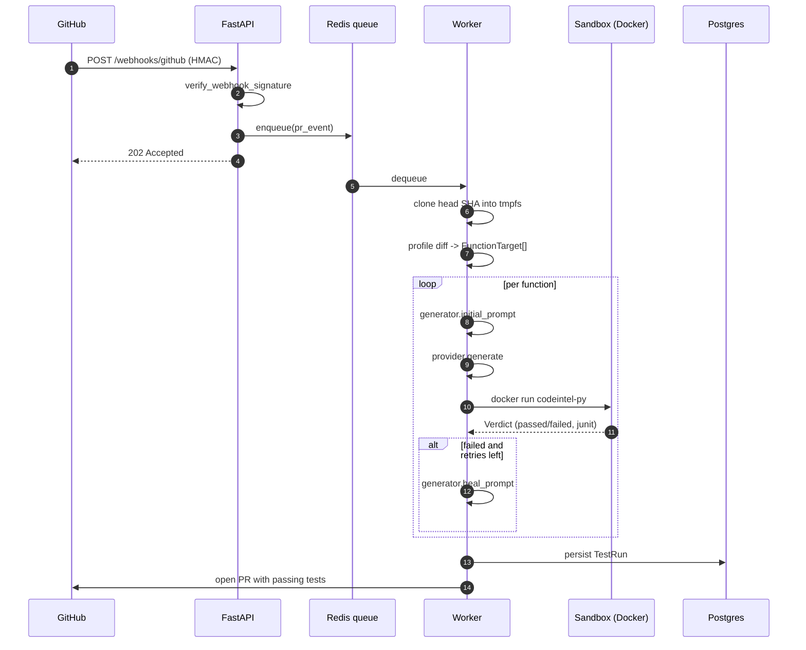
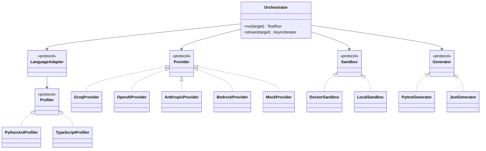
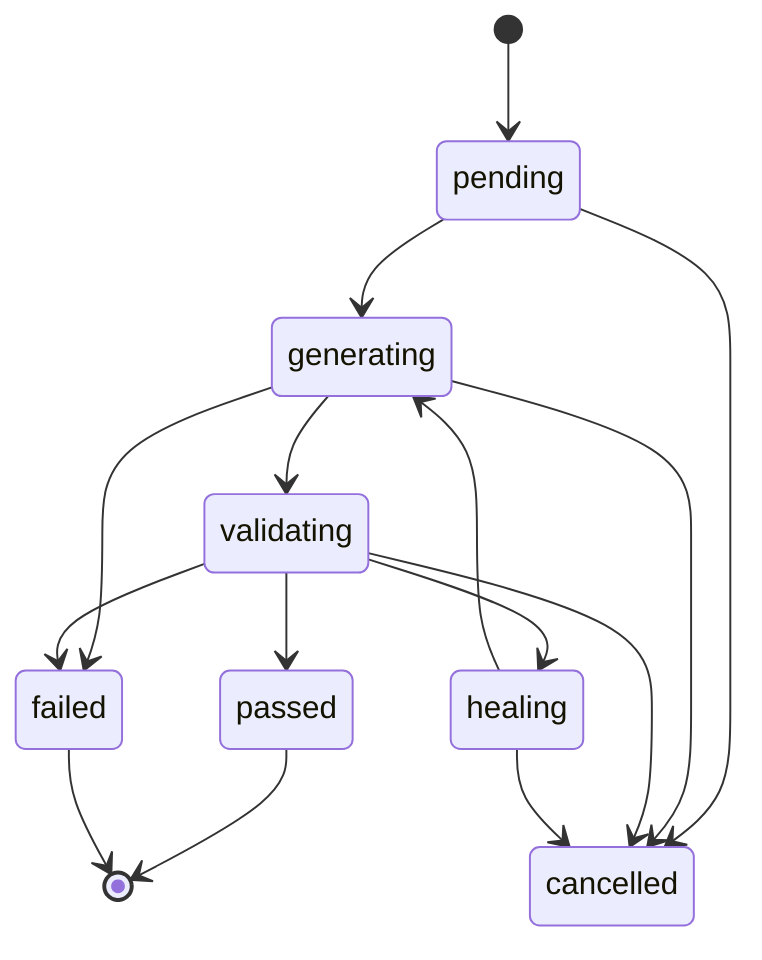

# Architecture

CodeIntel is a monorepo with one engine and three client surfaces. This
document explains the boundaries between components, the data flow, and
the trade-offs we picked.

## Components

| Layer | Tech | Lives in |
|---|---|---|
| Engine | Python 3.12, Pydantic v2, asyncio | [`packages/engine`](../packages/engine) |
| API gateway | FastAPI, SQLAlchemy 2, Alembic | [`apps/api`](../apps/api) |
| Dashboard | Next.js 14 (App Router), Tailwind, Clerk, Stripe | [`apps/dashboard`](../apps/dashboard) |
| IDE extension | TypeScript, vscode-api | [`apps/vscode-extension`](../apps/vscode-extension) |
| Sandbox | Docker (prod) or local subprocess (dev) | [`infra/docker`](../infra/docker) |
| Self-hosted | Helm chart | [`infra/helm`](../infra/helm) |

## End-to-end flow (PR-time, GitHub App)

## Engine decomposition

Every dependency arrow points at a protocol, not a concrete class.
That's the seam customers use to BYO their own LLM, sandbox, or
profiler.

## State machine

`TestRun.state` transitions only forward. Each transition is persisted so
runs survive worker restarts.

## Why these choices

- **FastAPI over Django** — async-native, smaller surface, OpenAPI for free.
- **Pydantic v2** — strict typing at the API edge; same models flow into the engine.
- **Docker sandbox over `subprocess`** — untrusted code from customer
  repos must never touch the API process.
- **uv + pnpm workspaces** — fastest dependency resolvers, one source of
  truth for each language.
- **Clerk + Stripe** — both have multi-tenant orgs built in; saves us months.
- **Tree-sitter for TS/JS, ast for Python** — both are pure-AST; we never
  ship a half-baked regex parser in production.
